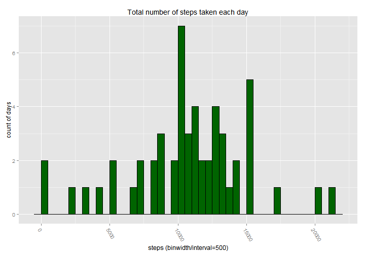

Activity monitoring devices analysis
========================================================

The variables included in this dataset are:

- steps: Number of steps taking in a 5-minute interval (missing values are coded as NA)
- date: The date on which the measurement was taken in YYYY-MM-DD format
- interval: Identifier for the 5-minute interval in which measurement was taken

Loading and preprocessing the data
--------------------------------------------------------

```r
library(ggplot2)
library(plyr)
library(scales)

# unzip only the required files
unzip("./repdata_data_activity.zip")

# the result is a data.frame of 17568 obs. of 3 variables
obs <- read.csv("./activity.csv")

# add a column containing the date and time for each obs
# a dummy date (execution date of the script) is used to obtain a date time format
obs$datetime <- 
  as.POSIXct(sprintf("%04d", obs$interval), format="%H%M", tz="GMT")

# add a column containing the timeinterval in the %H%M format
# this is required to have a nice plot showing the time intervals
obs$timeinterval <- 
  format(as.POSIXlt(sprintf("%04d", obs$interval), tz="GMT", format="%H%M"))
```

Below the summary of the data structure:

```r
str(obs)
```

```
## 'data.frame':	17568 obs. of  5 variables:
##  $ steps       : int  NA NA NA NA NA NA NA NA NA NA ...
##  $ date        : Factor w/ 61 levels "2012-10-01","2012-10-02",..: 1 1 1 1 1 1 1 1 1 1 ...
##  $ interval    : int  0 5 10 15 20 25 30 35 40 45 ...
##  $ datetime    : POSIXct, format: "2014-07-18 00:00:00" "2014-07-18 00:05:00" ...
##  $ timeinterval: chr  "2014-07-18 00:00:00" "2014-07-18 00:05:00" "2014-07-18 00:10:00" "2014-07-18 00:15:00" ...
```

Mean total number of steps taken per day
--------------------------------------------------------

### Histogram of the total number of steps taken each day

```r
# the result is a data.frame of 61 obs. of 2 variables
# NA have not been removed yet
d <- ddply(obs,.(date),summarize,steps=sum(steps))

# dates where the sum is NA will not be represented in the plot
# a total of 53 days is displayed (sum of each bar height)
p <- ggplot(d, aes(x=steps)) +
            geom_histogram(binwidth=500, colour = "black", fill="darkgreen") +
            theme(axis.text.x=element_text(angle = -60, hjust = 0)) +
            labs(x="steps (binwidth/interval=500)", y="count of days",
                 title="Total number of steps taken each day")
p
```

 

### Mean and Median values
***Mean*** of steps taken per day (NA are removed):

```r
mean(d$steps, na.rm=TRUE)
```

```
## [1] 10766
```


***Median*** of steps taken per day (NA are removed):

```r
median(d$steps, na.rm=TRUE)
```

```
## [1] 10765
```

Average daily activity pattern
--------------------------------------------------------

A time series plot (i.e. geom_line) of the 5-minute interval (x-axis) and the average number of steps taken, averaged across all days (y-axis) has been created.


```r
# data are summarized by the time interval
# the average is calculated
d <- ddply(obs, .(datetime), summarize, steps=mean(steps, na.rm=TRUE))

# a new column is added (to be used below)
d$timeinterval <- format(d$datetime, "%H:%M")
```

Find below a summary of the data:

```r
summary(d)
```

```
##     datetime                       steps        timeinterval      
##  Min.   :2014-07-18 00:00:00   Min.   :  0.00   Length:288        
##  1st Qu.:2014-07-18 05:58:45   1st Qu.:  2.49   Class :character  
##  Median :2014-07-18 11:57:30   Median : 34.11   Mode  :character  
##  Mean   :2014-07-18 11:57:30   Mean   : 37.38                     
##  3rd Qu.:2014-07-18 17:56:15   3rd Qu.: 52.83                     
##  Max.   :2014-07-18 23:55:00   Max.   :206.17
```

### Time series plot of 5-minute interval

```r
p <- ggplot(d, aes(x=datetime, y=steps)) +
            geom_line(colour = "darkgreen") +
            theme(axis.text.x=element_text(angle = -60, hjust = 0)) +
            labs(x="interval (5 minutes)", y="steps (average)",
                 title="Average number of steps by interval") + 
            # the x-axis label only shows 30 min slots 
            # this is to avoid too many labels and to keep the plot readable
            # the display interval is based on 5 minutes interval
            scale_x_datetime(
              breaks=date_breaks("30 min"),
              labels = date_format("%H:%M"),
              # adding a limit with a +1 -1 range as the chart automatically 
              # adds one hour at every edge
              limits = as.POSIXct(c(
                paste(format(Sys.time(), format="%Y-%m-%d"), "01:00:00", sep=" "),
                paste(format(Sys.time(), format="%Y-%m-%d"), "23:00:00", sep=" ")),
                tz="GMT"))
p
```

 


### Max number of steps in 5-minute interval
***"8:35 AM"*** is the 5-minute interval, on average across all the days in the dataset, containining the maximum number of steps: 

```r
d[d$steps==max(d$steps), c("timeinterval", "steps")]
```

```
##     timeinterval steps
## 104        08:35 206.2
```


These are the ***Top5*** 5-minute interval, on average across all the days in the dataset, containining the maximum number of steps: 

```r
head(d[order(d$steps, decreasing = TRUE), c("timeinterval", "steps")], n = 5L)
```

```
##     timeinterval steps
## 104        08:35 206.2
## 105        08:40 195.9
## 107        08:50 183.4
## 106        08:45 179.6
## 103        08:30 177.3
```


Imputing missing values
--------------------------------------------------------

### Total number of missing values

Total number of missing values in the dataset is: ***2304***, all missing values are in the steps variable.

```r
colSums(is.na(obs))
```

```
##        steps         date     interval     datetime timeinterval 
##         2304            0            0            0            0
```


### Imputing strategy
The imputing strategy choosen is to replace the NA values with the mean for that 5-minute interval.

The 5-minute interval values are saved in the d data set from the previous step.

### New dataset with imputed steps

```r
obscomplete <- obs

# add a variable called imputed_steps to the data frame
# fill the new variable with the values of the steps variable
obscomplete$imputed_steps <- obscomplete$steps

# impute the d$steps values into the obscomplete$imputed_steps variable
obscomplete[is.na(obscomplete$steps), "imputed_steps"] <- d$steps
```


The imputed_steps variable does not contain any missing values.
The steps variable still contains the original number of NA as it has not been modified.

```r
# validate that the imputed_steps variable does not contain any NA
# the steps variable still contains NA as it has not been modified
colSums(is.na(obscomplete))
```

```
##         steps          date      interval      datetime  timeinterval 
##          2304             0             0             0             0 
## imputed_steps 
##             0
```

### Histogram of the total number of steps taken each day (after imputing the mean for the 5-minute interval)

```r
# the result is a data.frame of 61 obs. of 2 variables
d <- ddply(obscomplete,.(date),summarize,imputed_steps=sum(imputed_steps))

# dates where the sum is NA will not be represented in the plot
# a total of 61 days is displayed (sum of each bar height)

# there is a different of 8 days in the 10500 to 11000 interval
# this is due to the imputation of the mean interval for 8 days
p <- ggplot(d, aes(x=imputed_steps)) +
            geom_histogram(binwidth=500, colour = "black", fill="darkgreen") +
            theme(axis.text.x=element_text(angle = -60, hjust = 0)) +
            labs(x="steps (binwidth/interval=500)", y="count of days",
                 title="Total number of steps taken each day")
p
```

 

### Mean and Median values
***Mean*** of steps taken per day (after imputing):

```r
mean(d$imputed_steps)
```

```
## [1] 10766
```


***Median*** of steps taken per day (after imputing):

```r
median(d$imputed_steps)
```

```
## [1] 10766
```


Differences in activity patterns between weekdays and weekends?
--------------------------------------------------------

### A new factor variable: "dow"

A new factor variable (called dow) is added to the imputed dataset with two levels - "weekday" and "weekend" indicating whether a given date is a weekday or weekend day.


```r
# add a column containing a factor indicating if the day is a weekday or a weekend
obscomplete$dow <- factor(as.POSIXlt(obscomplete$date)$wday %in% c(0, 6), labels=c("weekday", "weekend"))

#as.POSIXct(paste(as.Date(obs$date), sprintf("%04d", obs$interval)), format="%Y-%m-%d %H%M")

# summarize the date by the weekday/weekend factor
# and the 5 minutes interval
d <- ddply(obscomplete, .(dow,datetime), summarize, imputed_steps=mean(imputed_steps))
```


### Time series plot of 5-minute interval

The following plot contains a time series plot (i.e. geom_line) of the 5-minute interval (x-axis) and the average number of steps taken across all weekday days or weekend days (y-axis).


```r
# create a plot 
p <- ggplot(d, aes(x=datetime, y=imputed_steps)) +
            facet_grid(dow ~ .) +
            geom_line(aes(colour = dow)) +
            theme(axis.text.x=element_text(angle = -60, hjust = 0)) +
            labs(x="interval (5 minutes)", y="steps (average)",
                 title="Average number of steps by interval") + 
            scale_x_datetime(breaks=date_breaks("30 min"),
                             labels = date_format("%H:%M"),
# adding a limit with a +1 -1 range as the chart automatically adds one hour at every edge
                             limits = as.POSIXct(c(
                               paste(format(Sys.time(), format="%Y-%m-%d"), "01:00:00", sep=" "),
                               paste(format(Sys.time(), format="%Y-%m-%d"), "23:00:00", sep=" "))
                               , tz="GMT"))
p
```

 
